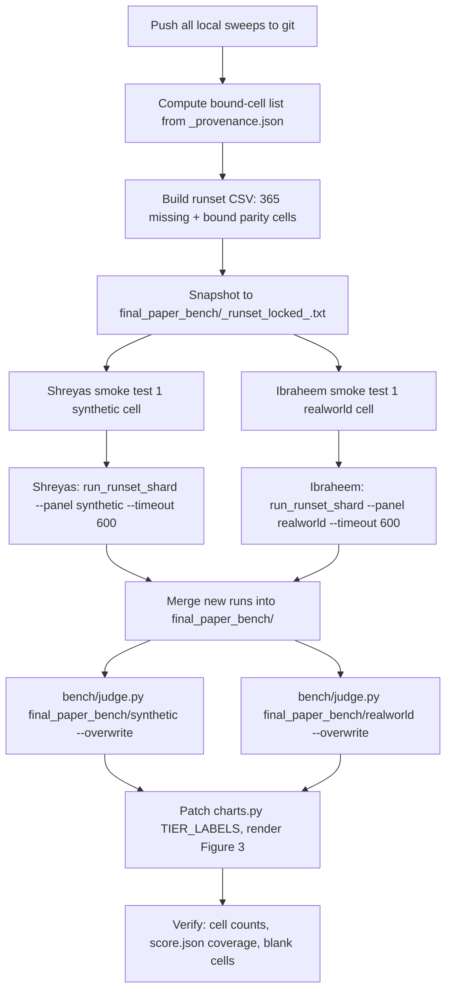

# Final-paper benchmark: rerun, judge, and relabel

## Context

Figure 3 of the ChatDBG-Pro paper compares two ablation tiers across 40 cases × 8 models = 640 cells per tier-pair, scored by `bench/judge.py` (LLM prose judge):

- **Paper T1 — bash only** (codebase `tier1` / `tier1_bash_only.json`)
- **Paper T2 — gdb only** (codebase `tier3` / `tier3_gdb_only.json`)

The agreed-upon source of truth for input artifacts is `bench/results/final_paper_bench/`. Three problems block re-judging today:

1. **Coverage gap** — 365 / 640 cells (57 %) have no `collect.json`.
2. **Timeout drift** — most archived sweeps ran at 240 s or 300 s, not 600 s. We only need to re-run the cells where the wall actually bound (`elapsed_s ≥ 0.95 × timeout`); the rest finished freely under 300 s and are valid.
3. **Tier-label confusion** — `final_paper_bench/README.md`, the `_missing_*.txt` lists, and the on-disk cell directory names all use the **codebase** tier numbering (1=bash, 3=gdb-only). The paper figure uses the **new paper-scheme labels** (T1=bash, T2=gdb-only). Need a label remap at chart time only — do **not** rename anything on disk.

T3 (paper) = bash+gdb is **out of scope**. T4 (paper) = Claude Code is documented as a follow-on but excluded from initial execution.

---

## Tier-label scheme (read carefully)

| On-disk / config name (codebase) | What it does | Paper figure label |
|---|---|---|
| `tier1_bash_only.json` (codebase 1) | bash only | **T1** |
| `tier3_gdb_only.json` (codebase 3) | gdb only, no bash | **T2** ← was "T3" everywhere on disk |
| `tier2_gdb_plus_bash.json` (codebase 2) | bash + gdb | T3 (out of scope) |
| `tier4_claude_code.json` (codebase 4) | Claude Code | T4 (follow-on) |

Files that currently use **codebase** numbering and stay that way:
- `bench/configs/tier*.json`, `bench/parallel_run.py:64-67`, `bench/external_runner.py:44-47`
- All cell dir names (`<case>__tier1__...`, `<case>__tier3__...`)
- `final_paper_bench/_missing_synthetic.txt`, `_missing_realworld.txt` (entries say `T1` / `T3`)
- `final_paper_bench/README.md` and `_provenance.json`

The only place we change the labels is **`bench/charts.py:27` `TIER_LABELS`** when generating the paper figure (see Step 5).

---

## Critical files

- `bench/results/final_paper_bench/README.md` — coverage source of truth
- `bench/results/final_paper_bench/_missing_{synthetic,realworld}.txt` — work list (codebase tier labels)
- `bench/results/final_paper_bench/_provenance.json` — `source_sweep`, `elapsed_s`, `timeout_was_600s` per cell
- `bench/parallel_run.py` — multi-cell launcher; `--timeout` defaults to **300 s** (line 118 — must always pass `--timeout 600`)
- `bench/orchestrator.py` — single-cell launcher; `--timeout` defaults to 300 s (line 186; same caveat)
- `bench/judge.py` — prose judge; `--overwrite` rescores cells that already have `score.json`
- `bench/charts.py` — figure generation; `TIER_LABELS` at line 27 is the single relabel chokepoint
- `bench/common.py` — `compile_case` (line 478), `prepare_injected_workspace` (282), `_apply_patch_ops` (255) — building blocks that the deferred apply-and-verify judge will reuse

---

## Work split (3 teammates)

Constraint: only Macs run the agent (host debugger differs by OS — Mac=lldb, Win=gdb — and we want a single debugger across the rerun set). Windows machine sits the agent runs out and contributes via judging / charts / PR review.

| Person | Machine | Owns | Rationale |
|---|---|---|---|
| Shreyas | Mac | All 365 missing + bound cells in **synthetic panel** | Shreyas can only run synthetic per the team agreement |
| Ibraheem | Mac | All 365 missing + bound cells in **real-world panel** | Larger build dependencies (BugsCPP / BugBench) ride on the spare Mac |
| Windows | — | Pre-flight scripts (this PR), re-judging once cells land, chart relabel + render | No agent runs on Windows |

Sharding is by **panel**, not by index modulo. This keeps each case fully owned by one teammate and avoids the lldb-vs-gdb confounder. The earlier 47 berry cells in `final_paper_bench/` were collected with the same containerized debugger path the Mac reruns will use, so the rerun is consistent.

## Execution plan



### Step 1 — Pre-flight (do before anything else)

1. Push every local sweep on every teammate's machine. Anything under `bench/results/` not in `git status -uno` is a duplicate-work hazard.
2. Verify `bench/orchestrator.py:186` and `bench/parallel_run.py:118`. Default is 300 s. Do **not** patch the default — just always pass `--timeout 600` explicitly. (Patching the default risks breaking other unrelated callers in `bench/run_*.sh`.)

### Step 2 — Build the bound-cell list

Write a one-shot script `bench/audit_bound_cells.py` that:

1. Loads `bench/results/final_paper_bench/_provenance.json`.
2. For each entry, opens the source `result.json` (path = `bench/results/archive/<source_sweep>/<source_cell>/result.json`) and reads `elapsed_s`, plus the original timeout. (`_provenance.json` already records `timeout_was_600s`; for non-600s, the original timeout is 240 s for `bugbench-*`, 300 s for `external-native-*`/`xtier-*`/`paper-cases*`/`new-cases`/`full-synthetic-v1-stripped`/`tier1-demo`/`t1-validation`. Hard-code that mapping in the script — it's already in the README's "Timeout audit" table.)
3. Emits CSV `final_paper_bench/_bound_cells_<date>.csv` with columns `panel,case,tier,model,source_sweep,timeout,elapsed_s,bound` where `bound = elapsed_s >= 0.95 * timeout`.
4. Prints the count of `bound=True` rows.

Expected: dozens of bound rows, not hundreds.

### Step 3 — Lock the runset

Write a second one-shot script `bench/build_runset.py` that emits:

`bench/results/final_paper_bench/_runset_locked_<date>.txt` — one line per cell to (re)run, format `<panel>\t<case>\tT<codebase_tier>\t<model>`, sourced from:
- All 365 lines in `_missing_synthetic.txt` + `_missing_realworld.txt` (strip the `# ...` comment lines and the `|` separators).
- All `bound=True` rows from the bound-cells CSV.
- Deduplicated by `(panel, case, tier, model)`.

The tier in this file stays in **codebase** numbering (1 / 3) — it's what `parallel_run.py --tiers` consumes.

Commit the locked runset so all three machines work from the same list.

### Step 4 — Smoke test (each Mac)

Pick one cell from your panel, run it solo first to confirm apptainer image resolves, model auth works, and `collect.json` lands:

```
# Shreyas (synthetic):
.venv-bench/bin/python -m bench.orchestrator \
    --models openrouter/openai/gpt-5.5 \
    --tool-configs bench/configs/tier1_bash_only.json \
    --tiers 1 \
    --bug-ids cjson-parse-string-oob \
    --timeout 600 --runtime apptainer --docker --skip-existing \
    --name smoke-synthetic-<date>

# Ibraheem (realworld):
.venv-bench/bin/python -m bench.orchestrator \
    --models openrouter/openai/gpt-5.5 \
    --tool-configs bench/configs/tier1_bash_only.json \
    --tiers 1 \
    --bug-ids berry-1 \
    --timeout 600 --runtime apptainer --docker --skip-existing \
    --name smoke-realworld-<date>
```

### Step 5 — Sharded parallel runs

`bench/run_runset_shard.py` (this PR):
1. Reads `final_paper_bench/_runset_locked_<date>.txt`.
2. Filters to rows where `panel == --panel`.
3. Groups by `(tier, model)` and shells out to `bench/parallel_run.py` once per group with the matching `--bug-ids`. (`parallel_run.py` already does the case × model cross-product, so one call per (tier, model) keeps the cross-product trivial.)
4. Always passes `--timeout 600 --runtime apptainer --workers 8 --name paper-final-<panel>-<date>`.

Per-Mac commands:

```
# Shreyas:
.venv-bench/bin/python -m bench.run_runset_shard \
    --runset bench/results/final_paper_bench/_runset_locked_<date>.txt \
    --panel synthetic

# Ibraheem:
.venv-bench/bin/python -m bench.run_runset_shard \
    --runset bench/results/final_paper_bench/_runset_locked_<date>.txt \
    --panel realworld
```

Output lands in `bench/results/paper-final-<panel>-<date>/`. Cell names follow the existing scheme (`<case>__tier<N>__<model_slug>__<config_slug>__ctx10__t1`), so the two Macs never collide.

### Step 6 — Merge new cells into `final_paper_bench/`

After all shards finish, copy each new cell into `final_paper_bench/<panel>/` (panel inferred by case_id — synthetic cases live in `bench/cases/`, real-world come from BugsCPP / BugBench / berry / crashbench / juliet — already classified in `_missing_*.txt`).

Reuse the existing copy logic that produced `final_paper_bench/` originally (referenced as `/tmp/copy_final_bench.py` in the README — it's not in-tree). Practical option: copy the script in-tree as `bench/copy_to_final_bench.py`, parametrize on a list of source sweep dirs, append new entries to `_provenance.json` rather than rewriting it.

### Step 7 — Re-judge (prose)

Single command per panel, run on whichever machine finishes first (judge is single-process and CPU-light):

```
.venv-bench/bin/python bench/judge.py bench/results/final_paper_bench/synthetic --overwrite
.venv-bench/bin/python bench/judge.py bench/results/final_paper_bench/realworld --overwrite
```

Notes:
- `--overwrite` is necessary because some old cells already have `score.json` from earlier sweeps; we want a fresh prose-judge pass on all 640 cells.
- Default judge model is `openai/gpt-4o`. Set `CHATDBG_JUDGE_MODEL` env var if a different judge is preferred.
- `judge.py` already short-circuits 0/0/0 for traces with `<50 chars` of prose + `>0` tool calls (`no_prose_synthesis` status — `judge.py:217`). That behavior is correct for our use; do not override.
- Wall-clock estimate: ~30–60 min per panel.

### Step 8 — Figure relabel + render

Patch `bench/charts.py:27`:

```python
TIER_LABELS = {
    1: "T1",   # bash only
    3: "T2",   # gdb only — paper-scheme rename
    2: "T3",   # bash+gdb — keep mapping defined for future T3 figures
    4: "T4",   # Claude Code — keep for future T4 figures
}
```

That single dict feeds `score_heatmap_by_model_tier.png` (`charts.py:209`). Verify by inspecting the rendered heatmap: the second tier column header should read "T2", not "T3". Current axis-label code (`charts.py:192`) uses `TIER_LABELS.get(tier, f"T{tier}")` — the dict change is sufficient.

Generate **two heatmap variants** (already supported by chart code if `--exclude-timeouts` is passed; if not, add a thin flag in `charts.py`):

- Timeouts-as-zero (canonical).
- Timeouts-excluded (sensitivity check for the appendix).

### Step 9 — Verify

- `find bench/results/paper-final-shard*-<date> -name collect.json | wc -l` matches the locked runset row count summed over all shards.
- `find bench/results/final_paper_bench/{synthetic,realworld} -name score.json | wc -l` equals **640**.
- Render Figure 3, eyeball every blank/gray cell. Each blank should be either (a) a `no_prose_synthesis` 0/0/0 (expected for some Gemini-FL-Lite cells) or (b) a model that legitimately didn't run (none expected after this pass).
- Spot-check 10 high-scoring cells: open the `collect.json` final response by hand against `case.yaml.criteria` to confirm prose-judge calls look reasonable.

---

## Follow-on work (not in this execution)

### F-1: Paper T4 (Claude Code) panel

If we decide to add T4 as a third bar:

1. T4 cells exist for 5 models in `bench/results/archive/external-native-ablation-20260504-merged/` (44 cells, codebase `tier4`, 300 s). Most won't be reusable — Claude Code runs need 600 s parity for the paper.
2. Cell budget: 40 cases × 1 model (Claude Code) at 600 s = 40 cells, single shard, ~7 hr worst case.
3. `bench/configs/tier4_claude_code.json` and `bench/drivers/tier4_claude.py` already wired into `parallel_run.py` (`--tiers 4`).
4. Auth: `ANTHROPIC_API_KEY` per `tier4_claude_code.json:8`.
5. Add `4: "T4"` is already in the relabel dict; chart will pick it up automatically.

### F-2: Apply-and-verify judge (`bench/judge_apply.py`)

Replaces the LLM prose rubric with a verdict from "agent's prose patch + recompile + rerun trigger". Implementation sketch (deferred):

1. Sibling file `bench/judge_apply.py` — does not modify `judge.py`.
2. New prompt `bench/prompts/judge_apply_extract.txt` — extract a unified diff or `(file, before, after)` triples from the agent's prose.
3. Materialize workspace: synthetic via `bench/common.py:compile_case` (478), injected via `bench/common.py:prepare_injected_workspace` (282). The triples-format aligns exactly with `_apply_patch_ops` (255) — reuse it directly.
4. Verdict: `fixed` if buggy binary crashes on trigger AND patched binary returns clean; else `not_fixed` / `compile_failed` / `no_patch` / `extract_failed`. Write `score.v2.json` next to existing `score.json`.
5. Validation gate: run on the 47 berry cells where prose-judge scores are trusted. Target ≥80 % agreement on `local_fix` / `global_fix`. Investigate every disagreement.
6. If the agreement gate fails, ship with prose judge (this is what the current execution plan already does).
