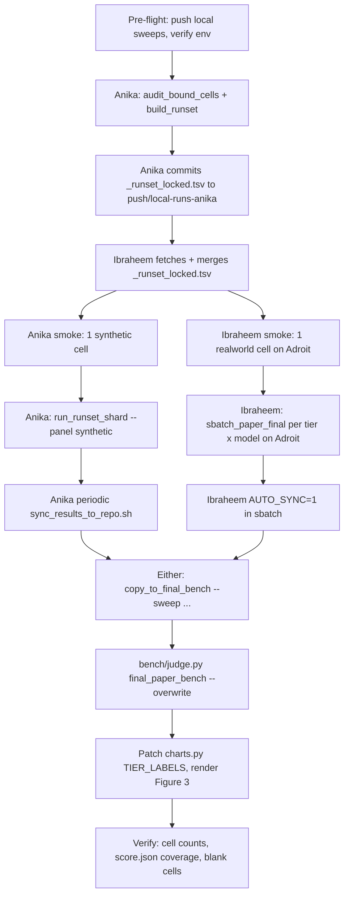

# Final-paper benchmark: rerun, judge, and relabel

## Context

Figure 3 of the ChatDBG-Pro paper compares two ablation tiers across 40 cases × 8 models = 640 cells per tier-pair, scored by `bench/judge.py` (LLM prose judge):

- **Paper T1 — bash only** (codebase `tier1` / `tier1_bash_only.json`)
- **Paper T2 — gdb only** (codebase `tier3` / `tier3_gdb_only.json`)

Source of truth for input artifacts: `bench/results/final_paper_bench/`.

Three problems block re-judging today:

1. **Coverage gap** — 365 / 640 cells (57 %) have no `collect.json`.
2. **Timeout drift** — most archived sweeps ran at 240 s or 300 s, not 600 s. Only re-run cells where the wall actually bound (`elapsed_s ≥ 0.95 × timeout`); the rest finished freely under 300 s and stay valid.
3. **Tier-label confusion** — the on-disk and config files use **codebase** numbering (1=bash, 3=gdb-only). The paper figure uses **paper labels** (T1=bash, T2=gdb-only). Remap at chart time only — do **not** rename anything on disk.

T3 (paper) = bash+gdb is **out of scope**. T4 (paper) = Claude Code is in §F-1 (follow-on, optional).

## Tier-label scheme

| On-disk / config name (codebase) | What it does | Paper figure label |
|---|---|---|
| `tier1_bash_only.json` (codebase 1) | bash only | **T1** |
| `tier3_gdb_only.json` (codebase 3) | gdb only, no bash | **T2** ← was "T3" everywhere on disk |
| `tier2_gdb_plus_bash.json` (codebase 2) | bash + gdb | T3 (out of scope) |
| `tier4_claude_code.json` (codebase 4) | Claude Code | T4 (follow-on) |

Files that stay in **codebase** numbering:
- `bench/configs/tier*.json`, `bench/parallel_run.py:64-67`, `bench/external_runner.py:44-47`
- All cell dir names (`<case>__tier1__...`, `<case>__tier3__...`)
- `final_paper_bench/_missing_synthetic.txt`, `_missing_realworld.txt`, `_provenance.json`, `_runset_locked.tsv`

Single relabel chokepoint: **`bench/charts.py:27` `TIER_LABELS`** (Step 8).

## Work split (Anika + Ibraheem, no Mac)

| Person | Machine | Owns | Branch |
|---|---|---|---|
| **Anika** | Windows + WSL2 (Docker Desktop) | All **synthetic** cells (T1 + T3, codebase) — 209 missing + bound parity | `push/local-runs-anika` |
| **Ibraheem** | Adroit (Linux + SLURM + apptainer) | All **realworld** cells (T1 + T3, codebase) — 156 missing + bound parity | `push/runs-ibraheem` |

Sharding rule: **whole panel × all tiers per owner**. No (panel, tier) is split across people. Each owner's sweep dirs are name-scoped (`<owner>-paper-final-<panel>-<date>-T<tier>-<modelslug>/`) so the two branches never collide on disk.

Per-teammate Claude Code handoff docs (read these in their respective sessions):
- `bench/RUNNER_HANDOFF_anika.md`
- `bench/RUNNER_HANDOFF_ibraheem.md`

Coordination model: each owner pushes only their own branch. To pull the other's data, `git fetch origin && git merge origin/<other-branch> --no-edit`. The shared `final_paper_bench/_runset_locked.tsv` is generated once (by whoever runs Step 2 first) and committed to whichever branch ran it — the other owner pulls it before starting Step 4.

## Critical files

Inputs:
- `bench/results/final_paper_bench/README.md` — coverage source of truth
- `bench/results/final_paper_bench/_missing_{synthetic,realworld}.txt` — work list (codebase tier labels)
- `bench/results/final_paper_bench/_provenance.json` — `source_sweep`, `elapsed_s` per cell

Helpers (committed in this PR):
- `bench/audit_bound_cells.py` — emits `_bound_cells.csv` from `_provenance.json`
- `bench/build_runset.py` — emits `_runset_locked.tsv` from missing + bound CSV
- `bench/run_runset_shard.py` — runs one (panel × selected tiers × selected models) shard via `bench.parallel_run`
- `bench/copy_to_final_bench.py` — merges fresh sweep cells into `final_paper_bench/<panel>/`
- `bench/sync_results_to_repo.sh` — git add + commit + pull-rebase + push (3-retry loop)
- `bench/sbatch_paper_final.sh` — SLURM wrapper for Adroit (one (panel, tier, model) group per job)
- `bench/RUNNER_HANDOFF_anika.md`, `bench/RUNNER_HANDOFF_ibraheem.md` — onboarding for each owner's Claude Code session

Existing infra these wrap:
- `bench/parallel_run.py` — multi-cell launcher (default `--timeout 300` — always pass `--timeout 600` explicitly)
- `bench/orchestrator.py` — single-cell launcher (default `--timeout 300` — same caveat)
- `bench/judge.py` — prose judge; `--overwrite` rescores cells that already have `score.json`
- `bench/charts.py` — figure generation; `TIER_LABELS` at line 27 is the single relabel chokepoint
- `bench/common.py` — `compile_case` (line 478), `prepare_injected_workspace` (282), `_apply_patch_ops` (255) — building blocks for the deferred apply-and-verify judge

## Execution plan



### Step 1 — Pre-flight

Both owners:
1. Push every local sweep on your machine. Anything under `bench/results/` not in `git status -uno` is a duplicate-work hazard.
2. Confirm `OPENROUTER_API_KEY` is in `.env` at repo root. `bench/orchestrator.py` autoloads dotenv.
3. Do **not** patch the 300 s defaults in `parallel_run.py:118` / `orchestrator.py:186`. Always pass `--timeout 600` explicitly. (Patching the defaults would risk breaking unrelated `bench/run_*.sh` callers.)

### Step 2 — Build the bound-cell list (Anika, one-shot)

```bash
python -m bench.audit_bound_cells \
    --provenance bench/results/final_paper_bench/_provenance.json \
    --archive    bench/results/archive \
    --out        bench/results/final_paper_bench/_bound_cells.csv
```

Reads each provenance entry, looks up `bench/results/archive/<source_sweep>/<source_cell>/result.json`, computes `bound = elapsed_s >= 0.95 * timeout`. Sweep→timeout mapping is hardcoded in the script per the README's "Timeout audit" table. Expected: dozens of bound rows, not hundreds.

### Step 3 — Lock the runset (Anika)

```bash
python -m bench.build_runset \
    --missing-synthetic bench/results/final_paper_bench/_missing_synthetic.txt \
    --missing-realworld bench/results/final_paper_bench/_missing_realworld.txt \
    --bound-csv         bench/results/final_paper_bench/_bound_cells.csv \
    --out               bench/results/final_paper_bench/_runset_locked.tsv

bash bench/sync_results_to_repo.sh \
     bench/results/final_paper_bench/_runset_locked.tsv \
     bench/results/final_paper_bench/_bound_cells.csv
```

Output TSV has columns `panel`, `case`, `tier` (codebase int), `model`. Sorted, deduplicated. `parallel_run.py --tiers` consumes the codebase int directly.

Ibraheem then `git fetch origin && git merge origin/push/local-runs-anika --no-edit` to pick up the runset.

### Step 4 — Smoke test (each owner, one cell)

```bash
# Anika (Windows/WSL, synthetic):
python -m bench.run_runset_shard \
    --runset bench/results/final_paper_bench/_runset_locked.tsv \
    --panel synthetic --tiers 1 --models openrouter/openai/gpt-5.5 \
    --owner anika --runtime docker --workers 1 --timeout 600

# Ibraheem (Adroit, realworld):
python -m bench.run_runset_shard \
    --runset bench/results/final_paper_bench/_runset_locked.tsv \
    --panel realworld --tiers 1 --models openrouter/openai/gpt-5.5 \
    --owner ibraheem --runtime apptainer --workers 1 --timeout 600
```

Confirm `bench/results/<owner>-paper-final-<panel>-*/<cell>/collect.json` lands.

### Step 5 — Sharded parallel runs

Anika (Windows/WSL, single host):
```bash
python -m bench.run_runset_shard \
    --runset bench/results/final_paper_bench/_runset_locked.tsv \
    --panel synthetic --owner anika --runtime docker --workers 8 --timeout 600
```
Run inside `tmux` so the sweep survives SSH/terminal disconnect.

Ibraheem (Adroit, SLURM):
```bash
for m in <8 model ids>; do
  for tier in 1 3; do
    sbatch --time=06:00:00 \
      --export=ALL,PANEL=realworld,TIERS=$tier,MODEL="$m",OWNER=ibraheem,AUTO_SYNC=1 \
      bench/sbatch_paper_final.sh
  done
done
```
Full enumerated loop is in `bench/RUNNER_HANDOFF_ibraheem.md`. `AUTO_SYNC=1` makes each job push its sweep dir to `push/runs-ibraheem` immediately after it finishes.

Cell-name scheme is the existing `<case>__tier<N>__<model_slug>__<config_slug>__ctx10__t1`. `--skip-existing` (default in the shim path) makes every command idempotent — re-running picks up after a crash.

### Step 6 — Periodic sync to repo (during long sweeps)

Anika (manual, every ~30 min while runs are flowing):
```bash
bash bench/sync_results_to_repo.sh bench/results/anika-paper-final-synthetic-*
```

Ibraheem (automatic via `AUTO_SYNC=1` in sbatch); manual fallback identical.

The sync script:
- Stages only the dirs you pass plus `_provenance.json` (never the whole tree).
- `git pull --rebase` + `git push`, with 3 retries on contention.
- Branch is your current branch (override with `GIT_USER_BRANCH=...` env).

### Step 7 — Merge new cells into `final_paper_bench/`

Either owner can do this once their shard finishes (or incrementally):
```bash
python -m bench.copy_to_final_bench \
    $(for d in bench/results/<owner>-paper-final-<panel>-*; do printf -- "--sweep %s " "$d"; done) \
    --runset bench/results/final_paper_bench/_runset_locked.tsv \
    --final  bench/results/final_paper_bench

bash bench/sync_results_to_repo.sh bench/results/final_paper_bench
```

Idempotent: cells already present in the target panel dir (and provenance) are skipped. Provenance is appended, never rewritten.

### Step 8 — Re-judge (prose)

Whoever has bandwidth, single command per panel:
```bash
python bench/judge.py bench/results/final_paper_bench/synthetic --overwrite
python bench/judge.py bench/results/final_paper_bench/realworld --overwrite
```

Notes:
- `--overwrite` is necessary because some old cells already have `score.json` from earlier sweeps; we want a fresh prose-judge pass on all 640 cells.
- Default judge model is `openai/gpt-4o`. Override with `CHATDBG_JUDGE_MODEL=...`.
- `judge.py:217` short-circuits 0/0/0 for traces with `<50 chars` of prose + `>0` tool calls (`no_prose_synthesis`). Correct behavior for our use; do not override.
- Wall-clock estimate: ~30–60 min per panel.

### Step 9 — Figure relabel + render

Patch `bench/charts.py:27`:
```python
TIER_LABELS = {
    1: "T1",   # bash only
    3: "T2",   # gdb only — paper-scheme rename
    2: "T3",   # bash+gdb — kept defined for future T3 figures
    4: "T4",   # Claude Code — kept for future T4 figures
}
```
Verify in the rendered heatmap: the second tier column header reads "T2", not "T3". `charts.py:192` already uses `TIER_LABELS.get(tier, f"T{tier}")` — the dict change is sufficient.

Generate **two heatmap variants**:
- Timeouts-as-zero (canonical).
- Timeouts-excluded (sensitivity check for the appendix).

If `--exclude-timeouts` isn't already a flag in `charts.py`, add it as a thin filter on the score rows.

### Step 10 — Verify

- `find bench/results/{anika,ibraheem}-paper-final-* -name collect.json | wc -l` matches the locked runset row count summed over both owners.
- `find bench/results/final_paper_bench/{synthetic,realworld} -name score.json | wc -l` equals **640**.
- Render Figure 3, eyeball every blank/gray cell. Each blank should be either (a) a `no_prose_synthesis` 0/0/0 (expected for some Gemini-FL-Lite cells) or (b) a model that legitimately didn't run (none expected after this pass).
- Spot-check 10 high-scoring cells against `case.yaml.criteria` for face validity.

## Follow-on (not in this execution)

### F-1: Paper T4 (Claude Code) panel

If we add T4 as a third bar:
1. T4 cells exist for 5 models in `bench/results/archive/external-native-ablation-20260504-merged/` (44 cells, codebase `tier4`, 300 s). Most won't be reusable — Claude Code runs need 600 s parity for the paper.
2. Cell budget: 40 cases × 1 model (Claude Code) at 600 s = 40 cells. ~7 hr worst case on a single host.
3. `bench/configs/tier4_claude_code.json` and `bench/drivers/tier4_claude.py` already wired into `parallel_run.py` (`--tiers 4`).
4. Auth: `ANTHROPIC_API_KEY`.
5. `4: "T4"` is already in the relabel dict; the chart picks it up automatically.

### F-2: Apply-and-verify judge (`bench/judge_apply.py`)

Replaces the LLM prose rubric with a verdict from "extract patch from prose → recompile → rerun trigger". Implementation sketch (deferred):
1. Sibling file `bench/judge_apply.py` — does not modify `judge.py`.
2. New prompt `bench/prompts/judge_apply_extract.txt` — extract a unified diff or `(file, before, after)` triples from the agent's prose.
3. Materialize workspace: synthetic via `bench/common.py:compile_case` (478), injected via `bench/common.py:prepare_injected_workspace` (282). The triples format aligns exactly with `_apply_patch_ops` (255) — reuse it directly.
4. Verdict: `fixed` if buggy binary crashes on trigger AND patched binary returns clean; else `not_fixed` / `compile_failed` / `no_patch` / `extract_failed`. Write `score.v2.json` next to existing `score.json`.
5. Validation gate: run on the 47 berry cells where prose-judge scores are trusted. Target ≥80 % agreement on `local_fix` / `global_fix`. Investigate every disagreement.
6. If the agreement gate fails, ship with prose judge.
